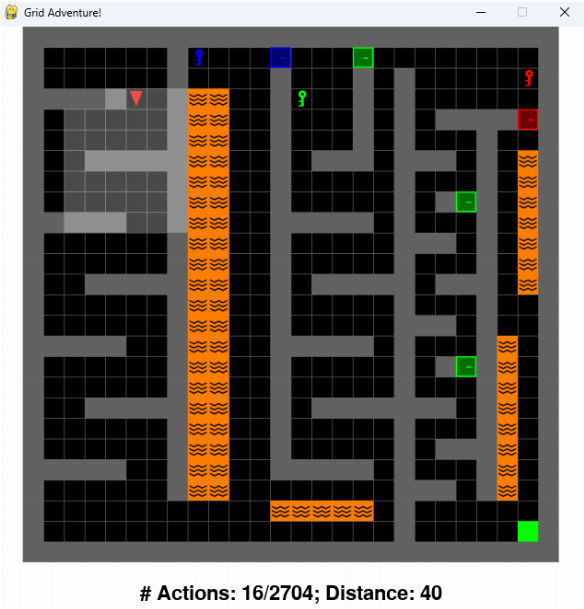
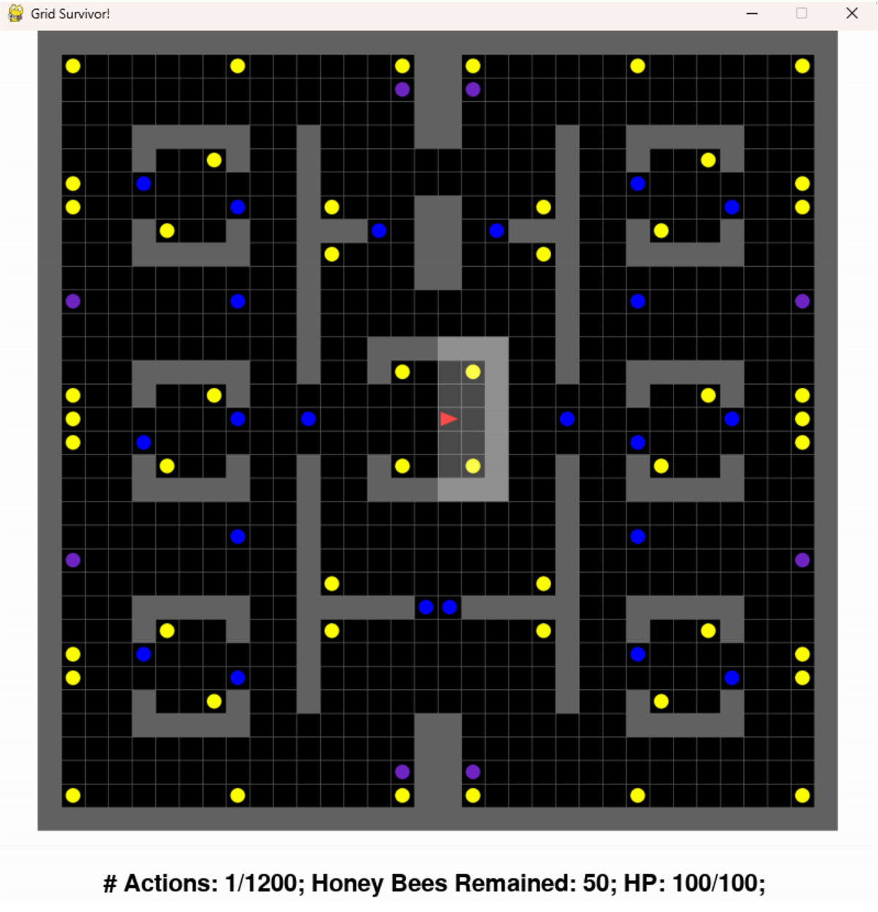
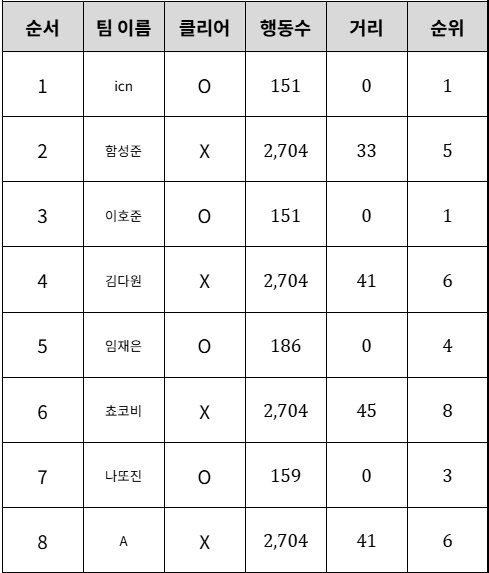
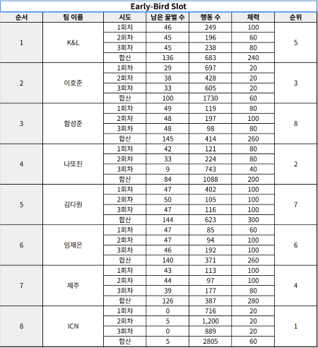
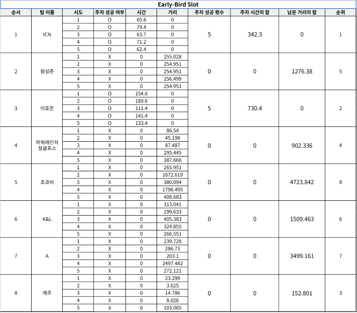

# Reinforcement Learning
### introduction
2024-2학기 인공지능 강의, 팀 프로젝트, team ICN
# Objective
## Round 1: [grid adventure!](https://docs.google.com/document/d/1DMapV7a4Rdw6Izys0AC_niAnsCbWH_ue6llX_sjVBc8/edit?tab=t.0)

### Description
플레이어는 좌표 [0, 0]에서 출발해서 좌표 [25, 25]에 있는 도착 지점으로 가야 합니다. 하지만, 그 앞을 가로막는 건 벽과, 용암과, 잠겨진 문이죠. 여러분은 벽과 용암을 피하고, 잠겨진 문을 열어서 미로를 탈출하는 에이전트를 훈련해야 합니다!
## Round 2: [grid surviver!](https://docs.google.com/document/d/1meNNdSXjKz4h3rC6tYa_H6gr1xSnDJQkco9Q1Exi51Q/edit?tab=t.0)

### Description
또 다시 플레이어는 미로에 갇혔습니다! 이 미로에는 꿀벌들도 함께 갇혀버렸습니다. 플레이어는 말벌과 살인벌들을 피해서 이 꿀벌들을 모두 구해야합니다!
## Round 3 : [road hog!](https://docs.google.com/document/d/190zElflpGtB_ldWz7r0vcOEJ20YE1LWSstduOAvhHDg)

### Description
고속도로에서 운전중인 플레이어는 굉장히 화장실이 급합니다! 고작해야 2분만 참을 수 있을 것 같아요. 그 시간이 지나가면 여러분의 차는 내부 세차를 해야 할 수도 있습니다. 그러니, 얼른 휴게소로 가야합니다. 하지만, 도로에는 다른 차량들도 많고, 휴게소의 주차장에도 많은 차량이 주차되어 있군요. 플레이어는 도로의 무법자가 되어 차선을 위반하고, 다른 차량과 휴게소 건물을 들이받는 대신 합법적으로 휴게소에 주차를 해야합니다!
# Results
### [result sheet](https://docs.google.com/spreadsheets/d/1ubyjUTA8REOA0wJz0lg1jNjxtiAS0l_HWs0vrxtx6WI)
## Round 1

## Round 2

## Round 3

